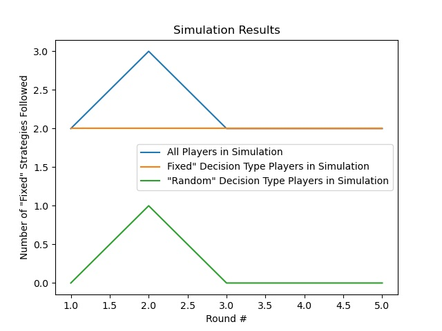

# AI Simulation

## Contents
* [Overview](#Overview)
    * [Assumptions](#Assumptions)
* [Python Script](#Python-Script)
    * [Simulation Results](#Simulation-Results)
* [Credit](#Credit)

## Overview
We used <b>Python</b> to simulate results to the questionnaire in the <b>Web Application</b>.  
The <a href = "naive_AI.py">naive_AI</a> <b>Python</b> script makes predictions of user data. 
It was written with the establishment of several assumptions regarding user behavior, which are discussed below. The script imports the 
<b>Matplotlib Library</b> to generate data visualizations of the simulation results as well as the actual data collected from the deployed app.  

### Assumptions
There are players with either of <b>2 Decision Types</b> (i.e. <b>'Fixed'</b>, <b>'Random'</b>). If the <b>Strategy</b> corresponding to their <b>Decision Type</b> provides the players a <b>Profit</b> in the current round of the questionnaire, they continue as before for the next round. However, if they make a <b>Loss</b> from following the default <b>Strategy</b>, they have a chance of temporarily switching their <b>Strategy</b> for the next round in the questionnaire. The original <b>Decision Type</b> of the player doesn't change regardless of the <b>Play Outcome</b> (i.e. <b>Profit</b>, <b>Loss</b>).

## Python Script
The <b>Python</b> script produces simulation results through calling several <i>custom functions</i> in a <i>main function</i> to separate the simulation results of interest to our purposes. 

These include :
<ul>
    <li>Total Number of "Fixed" Strategies Followed in Each Round</li>
    <ul>
        <li>Number of "Fixed" Strategies Followed in Each Round by "Fixed" Players</li>
        <li>Number of "Fixed" Strategies Followed in Each Round by "Random" Players</li>
    </ul>
</ul>

### Simulation Results
Here is an example of the results derived from the simulation.

## Credit
Credit should be provided to <b>Simon Frasier University</b> and <b>Professor Farouk Abdul-Salam</b> for providing
insight into the usage of these tools to create and deploy the app. This was completed as part of an 
<a href = "https://sites.google.com/view/farouk-abdul-salam/my-teaching-workshop/workshop?authuser=0">Online Workshop</a>.