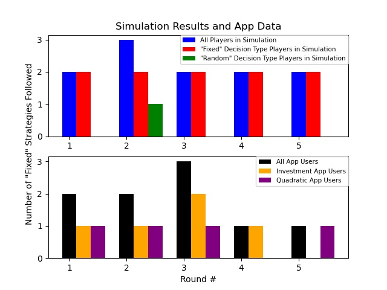

# AI Simulation and Graphical Analysis

## Contents
* [Overview](#Overview)
    * [Assumptions](#Assumptions)
* [Python Script](#Python-Script)
    * [Simulation Results](#Simulation-Results)
    * [App Data](#App-Data)
* [Graphical Analysis](#Graphical-Analysis)
* [Credit](#Credit)

## Overview
We used <b>Python</b> to simulate results to the questionnaire in the <b>Web Application</b>.  
The <a href = "naive_AI.py">Naive AI</a> <b>Python</b> script makes predictions of player behavior. 
It was written with the establishment of several assumptions regarding user behavior, which are discussed below. The script imports the 
<b>Matplotlib Library</b> to generate data visualizations of the simulation results as well as the actual data collected from the deployed app. 
We deal with the data imported from the <b>Excel Spreadsheet</b> using the <b>Pandas Library</b> and inputting the information into a <b>DataFrame</b>. 
<i>For more information on this, see the <a href = "../workshop_data">workshop_data</a> directory.</i>

### Assumptions
There are players with either of <b>2 Decision Types</b> (i.e. <b>'Fixed'</b>, <b>'Random'</b>). If the <b>Strategy</b> corresponding to their <b>Decision Type</b> provides the players a <b>Profit</b> in the current round of the questionnaire, they continue as before for the next round. However, if they make a <b>Loss</b> from following the default <b>Strategy</b>, they have a chance of temporarily switching their <b>Strategy</b> for the next round in the questionnaire. The original <b>Decision Type</b> of the player doesn't change regardless of the <b>Play Outcome</b> (i.e. <b>Profit</b>, <b>Loss</b>).

## Python Script

### Simulation Results
The <b>Python</b> script produces simulation results through calling several <i>custom functions</i> in a <i>main function</i> to separate the simulation results of interest for our purposes. 

These include :
<ul>
    <li>Total Number of '<b>Fixed</b>' <b>Strategies</b> Followed in Each Round</li>
    <ul>
        <li>Number of '<b>Fixed</b>' <b>Strategies</b> Followed in Each Round by '<b>Fixed</b>' Players</li>
        <li>Number of '<b>Fixed</b>' <b>Strategies</b> Followed in Each Round by '<b>Random</b>' Players</li>
    </ul>
</ul>

### App Data
Similarly, we acquire the useful app data from the <a href = "../workshop_data/Relevant_Results.xlsx">Relevant Results</a> <b>Excel Spreadsheet</b> 
and analyze the results for purposes. 

These include :
<ul>
    <li>Total Number of '<b>Fixed</b>' <b>Strategies</b> Followed in Each Round</li>
    <ul>
        <li>Number of '<b>Fixed</b>' <b>Strategies</b> Followed in Each Round by <b>Quadratic</b> App Users</li>
        <li>Number of '<b>Fixed</b>' <b>Strategies</b> Followed in Each Round by <b>Investment</b> App Users</li>
    </ul>
</ul>

## Graphical Analysis
Two subplots were generated using the <b>Matplotlib Library</b> to compare our theoretical model with the actual data. Here is an example of a bar graph comparison between our simulation results and the actual data collected from the app.

## Credit
Credit should be provided to <b>Simon Frasier University</b> and <b>Professor Farouk Abdul-Salam</b> for providing
insight into the usage of these tools to create and deploy the app. This was completed as part of an 
<a href = "https://sites.google.com/view/farouk-abdul-salam/my-teaching-workshop/workshop?authuser=0">Online Workshop</a>.